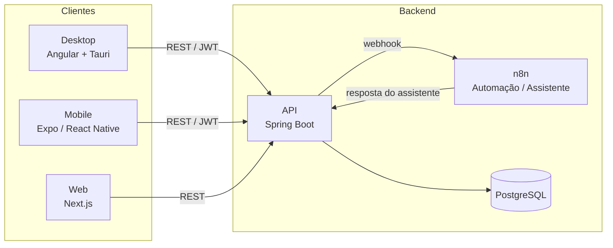
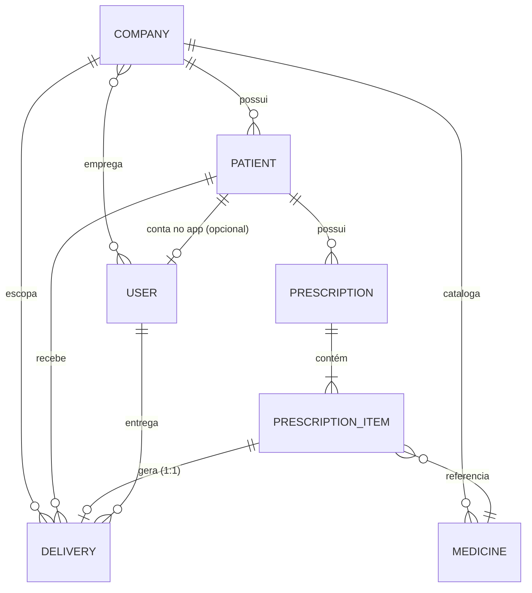
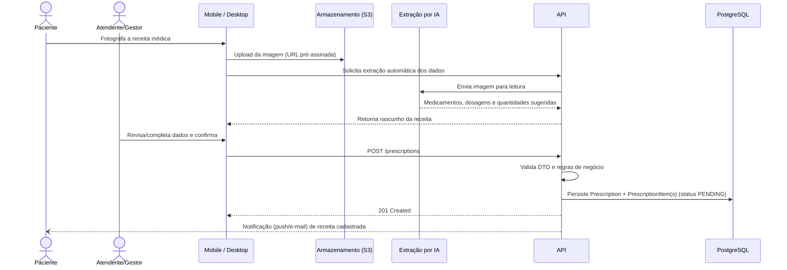

# ChegaMed

<div align="center">
    
    <div data-badges>
        
        
        
        
        <br/>
        
        
        
        
        <br/>
        
        
        
        
    </div>
</div>

<br/>

## Sobre o projeto

**ChegaMed** é um sistema de controle e distribuição de medicamentos públicos para prefeituras e secretarias municipais de saúde. O objetivo do produto é garantir que pacientes cadastrados em uma unidade de saúde recebam seus medicamentos de uso contínuo ou de curto prazo **no tempo correto**, eliminando falhas de comunicação, retrabalho manual e falta de rastreabilidade entre a receita médica emitida, o estoque disponível e a efetiva entrega ao paciente.

A plataforma é composta por uma **API central** que concentra toda a regra de negócio e persistência, um **aplicativo desktop** de back-office para gestores e atendentes, um **aplicativo mobile** voltado para pacientes e entregadores, um **site institucional/público** para cadastro e páginas legais, e um motor de automação (**n8n**) que dá suporte ao assistente virtual do produto.

> **Versão atual:** `1.0.0`

## Visão geral da arquitetura

| Camada          | Aplicação               | Público-alvo                             | Stack principal                      |
| --------------- | ----------------------- | ---------------------------------------- | ------------------------------------ |
| Backend         | [`api/`](./api)         | — (serviço central)                      | Java 21 · Spring Boot 4 · PostgreSQL |
| Back-office     | [`desktop/`](./desktop) | Gestores, atendentes, administradores    | Angular 21 · Tauri v2                |
| App do paciente | [`mobile/`](./mobile)   | Pacientes e entregadores                 | Expo (React Native)                  |
| Site público    | [`web/`](./web)         | Visitantes, autocadastro, páginas legais | Next.js 16 (React 19)                |
| Automação       | `n8n` (Docker)          | Fluxos do assistente virtual             | n8n                                  |
| Persistência    | `postgres` (Docker)     | Banco de dados relacional                | PostgreSQL 18                        |



Os três clientes (desktop, mobile e web) conversam exclusivamente com a **API**, que é a única aplicação com acesso ao banco de dados. A API delega o processamento de linguagem natural do assistente virtual para o **n8n** via webhook, e utiliza serviços externos (AWS S3 para armazenamento de imagens de receitas, Gemini para extração de dados das receitas fotografadas, Resend para e-mails transacionais e Expo Push para notificações).

## Principais tecnologias

- **Backend:** Java 21, Spring Boot 4, Spring Data JPA/Hibernate, Spring Security, Flyway, JWT (jjwt), springdoc-openapi (Swagger), AWS SDK (S3), Google API Client, Nimbus JOSE+JWT (Sign in with Apple)
- **Desktop:** Angular 21, NgRx (store/effects/signals), Tauri v2 (Rust), Chart.js, Vitest
- **Mobile:** Expo SDK 54, React Native 0.81, Expo Router, React Navigation, Expo Notifications/Camera/Secure Store, Jest
- **Web:** Next.js 16 (App Router), React 19, Tailwind CSS 4, Zod
- **Infraestrutura:** Docker & Docker Compose, PostgreSQL 18, n8n, AWS (EC2, Route 53, S3, EventBridge Scheduler)

## Estrutura do repositório

```
controle-de-remedios/
├── api/          # API REST central (Spring Boot)
├── desktop/      # Aplicativo de back-office (Angular + Tauri)
├── mobile/       # Aplicativo do paciente/entregador (Expo)
├── web/          # Site público e páginas legais (Next.js)
├── docs/         # Diagramas e documentação complementar
├── docker-compose.yml
└── .env.sample
```

Cada aplicação possui seu próprio README com instruções detalhadas de instalação, execução e testes:

- [api/README.md](./api/README.md)
- [desktop/README.md](./desktop/README.md)
- [mobile/README.md](./mobile/README.md)
- [web/README.md](./web/README.md)

## Modelo de dados principal

O domínio central do ChegaMed gira em torno da **receita médica (`Prescription`)**, que agrupa um ou mais itens de medicamento (`PrescriptionItem`). Cada item, quando dispensado, gera um registro de **entrega (`Delivery`)**.



### Entidades principais

| Entidade           | Descrição                                 | Campos-chave                                                                                                           |
| ------------------ | ----------------------------------------- | ---------------------------------------------------------------------------------------------------------------------- |
| `Company`          | Tenant do sistema (prefeitura/secretaria) | `name`, `slug` (único), `cnpj` (único), `active`                                                                       |
| `User`             | Usuário do sistema, com papel (`role`)    | `email` (único), `cpf` (único), `role`: `ADMIN`, `MANAGER`, `ASSISTANT`, `PATIENT`, `DELIVERER`                        |
| `Patient`          | Paciente vinculado a uma empresa          | `cpf`, `birthdate`, `contact`, `address`; único por `company_id + cpf`                                                 |
| `Medicine`         | Medicamento do catálogo de uma empresa    | `name`, `eanCode`; único por `company_id + ean_code`                                                                   |
| `Prescription`     | Receita médica do paciente                | `status`, `imageUrls[]`, `issueDate`                                                                                   |
| `PrescriptionItem` | Item (medicamento) de uma receita         | `dosage`, `prescribedQuantity`, `unityType`, `treatmentType`, `treatmentDays`, `receivedQuantity`, `deliveredQuantity` |
| `Delivery`         | Entrega efetiva de um item de receita     | `deliveryDate`, `nextAvailableDate`, `deliveryQuantity`; único por `prescriptionItem`                                  |

### Relacionamentos

- `Company` **1‑N** `Patient`, `Medicine`, `Delivery` e **N‑N** `User` (uma empresa tem vários usuários e um usuário pode atuar em várias empresas)
- `Patient` **1‑N** `Prescription` e `Delivery`, e opcionalmente **1‑1** com um `User` (conta de acesso ao app)
- `Prescription` **1‑N** `PrescriptionItem` (exclusão em cascata)
- `PrescriptionItem` **N‑1** `Medicine` e **1‑1** (opcional) `Delivery`
- `Delivery` **N‑1** `User` (entregador, opcional)

### Status da receita e do item (`PrescriptionStatus`)

`PENDING` → `OUT_FOR_DELIVERY` → `DELIVERED` (ou `PARTIAL_DELIVERED`), com possibilidade de `CANCELED` enquanto pendente ou em rota de entrega.

- **Despachável:** `PENDING`
- **Entregável:** `PENDING`, `OUT_FOR_DELIVERY`
- **Cancelável:** `PENDING`, `OUT_FOR_DELIVERY`
- **Concluída:** `DELIVERED`, `PARTIAL_DELIVERED`

O status agregado da receita é recalculado automaticamente a partir do status de seus itens a cada mudança (dispensação parcial, cancelamento de item, etc.).

## Regras de negócio

- Uma receita sempre nasce com status `PENDING`, assim como todos os seus itens (`receivedQuantity` e `deliveredQuantity` começam em `0`).
- Cada item deve referenciar um medicamento existente no catálogo (`medicineId`) **ou** enviar os dados para criação de um novo medicamento — nunca os dois ausentes (`MEDICINE_REQUIRED`).
- O medicamento referenciado precisa pertencer à **mesma empresa** do paciente (`MEDICINE_COMPANY_MISMATCH`), garantindo isolamento entre prefeituras (multi-tenant).
- **Período de tratamento:** se já existir uma entrega anterior do mesmo medicamento para o paciente com `nextAvailableDate` no futuro, uma nova solicitação é rejeitada (`MEDICINE_STILL_IN_TREATMENT_PERIOD`) — evita retirada antecipada de medicamentos de uso contínuo.
- Apenas `ADMIN`, ou `MANAGER`/`ASSISTANT` vinculados à empresa do paciente, podem criar/atualizar receitas; exclusão é restrita a `MANAGER`/`ADMIN`.
- O papel `DELIVERER` não tem acesso à listagem de receitas — apenas às entregas atribuídas a ele.
- Um item só pode ser cancelado se estiver em `PENDING` ou `OUT_FOR_DELIVERY` (`PRESCRIPTION_ITEM_NOT_CANCELABLE`); o cancelamento recalcula o status agregado da receita e dispara uma notificação.
- A data de emissão da receita (`issueDate`) não pode estar no futuro.

## Caso de uso: cadastro de receitas

Fluxo completo de cadastro de uma receita médica, desde a captura até a entrega ao paciente:



1. O paciente fotografa a receita pelo aplicativo mobile (ou anexa a imagem pelo desktop), que é enviada ao S3 através de uma URL pré-assinada gerada pela API.
2. Opcionalmente, a API envia a imagem para o módulo de IA (Gemini), que extrai automaticamente medicamentos, dosagens e quantidades, retornando um rascunho para revisão.
3. Um atendente/gestor confirma os dados e envia a requisição de criação:

```json
POST /prescriptions
{
  "patientId": "8f14e45f-ceea-467a-8083-8a...",
  "issueDate": "2026-08-10",
  "imageUrls": ["https://cdn.chegamed.com.br/prescriptions/8f14e45f.png"],
  "items": [
    {
      "medicineId": "3b241101-e2bb-4255-8caf-4136c566a...",
      "dosage": "1 comprimido a cada 8 horas",
      "prescribedQuantity": 30,
      "unityType": "TABLET",
      "treatmentType": "CONTINUOUS",
      "treatmentDays": 30,
      "observations": "Tomar após as refeições"
    },
    {
      "medicine": { "name": "Dipirona 500mg" },
      "dosage": "1 comprimido se dor",
      "prescribedQuantity": 10,
      "unityType": "TABLET",
      "treatmentType": "SHORT_TERM",
      "treatmentDays": 5
    }
  ]
}
```

4. A API valida o payload (campos obrigatórios, datas, quantidades positivas), resolve cada medicamento (existente ou novo, sempre dentro da empresa do paciente) e verifica se o paciente está apto a receber cada medicamento (fora do período de tratamento vigente).
5. A receita é persistida com status `PENDING`, junto de seus itens, e uma notificação é disparada para os interessados (push, in-app e/ou e-mail).
6. O item segue o fluxo operacional: `PENDING` → `OUT_FOR_DELIVERY` (despacho) → `DELIVERED`/`PARTIAL_DELIVERED` (gera um registro em `Delivery`, com data da próxima retirada calculada para tratamentos contínuos).
7. Enquanto não finalizada, a receita (ou item) pode ser cancelada por um gestor/administrador.

## Executando o ambiente completo

Os serviços de backend (API, banco de dados e automação) podem ser levantados via Docker Compose a partir da raiz do repositório:

```bash
cp .env.sample .env
# preencha as variáveis de ambiente necessárias
docker compose up -d
```

Isso sobe:

- **`postgres`** — banco de dados PostgreSQL 18, na porta `5432`
- **`api`** — API Spring Boot, na porta `8080`
- **`n8n`** — motor de automação que atende os fluxos do assistente virtual, na porta `5678`

Para desenvolvimento local, cada cliente (`desktop`, `mobile`, `web`) pode ser executado individualmente apontando para a API local — consulte o README de cada aplicação.

### Variáveis de ambiente

O arquivo [`.env.sample`](./.env.sample) documenta todas as variáveis usadas pelo ambiente. Principais grupos:

| Grupo                  | Variáveis (exemplos)                                                                                                      |
| ---------------------- | ------------------------------------------------------------------------------------------------------------------------- |
| Banco de dados         | `POSTGRES_USER`, `POSTGRES_PASSWORD`, `POSTGRES_DB`                                                                       |
| Autenticação           | `JWT_SECRET`, `OAUTH_CLIENT_ID_WEB/MOBILE/DESKTOP`, `OAUTH_CLIENT_SECRET`, `APPLE_BUNDLE_ID`                              |
| Armazenamento (AWS S3) | `AWS_ACCESS_KEY_ID`, `AWS_SECRET_ACCESS_KEY`, `AWS_REGION`, `AWS_S3_BUCKET`, `AWS_S3_PUBLIC_BASE_URL`, `AWS_CDN_BASE_URL` |
| Automação (n8n)        | `N8N_HOST`, `N8N_PORT`, `N8N_ENCRYPTION_KEY`, `N8N_BASIC_AUTH_USER/PASSWORD`, `WEBHOOK_URL`                               |
| Assistente / IA        | `ASSISTANT_INTERNAL_SECRET`, `GEMINI_API_KEY`                                                                             |
| E-mail                 | `RESEND_API_KEY`, `RESEND_FROM_EMAIL`, `SUPPORT_EMAIL`                                                                    |
| Notificações push      | `EXPO_PUSH_ENABLED`, `EXPO_ACCESS_TOKEN`                                                                                  |
| Front-ends             | `APP_LOGO_URL`, `APP_WEB_URL`, `DESKTOP_RESET_PASSWORD_URL`, `MOBILE_RESET_PASSWORD_URL`                                  |

## Telas

<div align="center">
    
    
    
</div>

## Documentação complementar

O diretório [`docs/`](./docs) contém o diagrama de classes completo do domínio (`class-diagram.asta`), utilizado como referência para a modelagem apresentada acima.

## Autor

Desenvolvido por **Luan Alves** ([contato@devluanpaiva.com.br](mailto:contato@devluanpaiva.com.br)).
